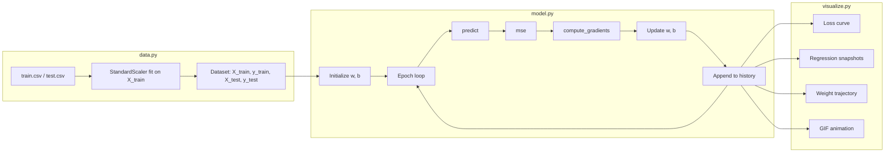

# `src/` — ML Core Flow

NumPy-only linear regression with **manual gradient descent** (no autograd).  
This folder is the revision core — the Streamlit app in `app/` imports it but does not modify it.

**Run the CLI pipeline:**

```bash
uv run --python alr/bin/python -m src.main
```

---

## File map

| File | Role |
|------|------|
| `data.py` | Load CSVs, z-score `X`, return `Dataset` |
| `loss.py` | Forward pass helper, MSE, manual gradients |
| `model.py` | `LinearRegressionGD` — training loop + `history` |
| `visualize.py` | Matplotlib plots and GIF animation from `history` |
| `main.py` | Glue: load → train → save plots to `outputs/` |

---

## End-to-end flow



**One sentence version:**

> CSV → standardized features → predict → measure error (MSE) → compute gradients → update $(w, b)$ → repeat → plot the path.

---

## One training epoch (the inner loop)

This is what happens inside `LinearRegressionGD.fit()` for each epoch:

```
┌─────────────────────────────────────────────────────────────┐
│  1. FORWARD PASS          y_hat = w * x + b                 │
│     (loss._predict / model.predict)                         │
├─────────────────────────────────────────────────────────────┤
│  2. LOSS                  L = (1/2n) * Σ(y_hat - y)²        │
│     (loss.mse)                                              │
├─────────────────────────────────────────────────────────────┤
│  3. GRADIENTS             dw = (1/n) * Σ error * x          │
│     (loss.compute_gradients) db = (1/n) * Σ error           │
├─────────────────────────────────────────────────────────────┤
│  4. UPDATE                w ← w - α * dw                      │
│                           b ← b - α * db                    │
├─────────────────────────────────────────────────────────────┤
│  5. LOG                   history["loss"].append(L)          │
│                           history["w"].append(w)            │
│                           history["b"].append(b)            │
└─────────────────────────────────────────────────────────────┘
```

$\alpha$ = learning rate (`lr`).  
Early stop if $|L_t - L_{t-1}| < \text{convergence\_tol}$.

---

## Module details

### 1. `data.py` — prepare the numbers

**Input:** `data/train.csv`, `data/test.csv` (columns `x`, `y`).

**Steps:**

1. Load CSVs with pandas, drop rows with missing values.
2. Extract `X` and `y` as `float64` NumPy arrays.
3. Optionally standardize **X only** (z-score):
   - `fit` scaler on `X_train` → learn $\mu$, $\sigma$
   - `transform` both train and test with those stats (no leakage)
4. Reshape `X` to `(n_samples, 1)` for the training loop.

**Output:** frozen `Dataset` dataclass:

```python
Dataset(
    X_train,   # (699, 1) after scaling
    y_train,   # (699,)   raw units
    X_test,
    y_test,
    feature_scaler,
)
```

**Why standardize X but not y?**  
Scaled features make gradient descent stable when $x$ and $y$ live on different scales. We keep $y$ raw so loss values and plots stay easy to read.

Deep dive: [my_learnings/01_standardization.md](../my_learnings/01_standardization.md)

---

### 2. `loss.py` — math only, no training

Pure functions. Nothing here updates $w$ or $b$.

| Function | Purpose |
|----------|---------|
| `_predict(X, w, b)` | $\hat{y} = wx + b$ |
| `mse(y_true, y_pred)` | $L = \frac{1}{2n}\sum(\hat{y} - y)^2$ |
| `compute_gradients(X, y, w, b)` | Returns `(dw, db)` |

**MSE uses $\frac{1}{2n}$; gradients use $\frac{1}{n}$.**  
The extra $\frac{1}{2}$ in the loss is a calculus convenience — it cancels when you differentiate $(\hat{y} - y)^2$.

```python
error = y_pred - y
dw = (1 / n) * np.dot(X.flatten(), error)
db = (1 / n) * np.sum(error)
```

Deep dive: [my_learnings/04_loss_and_gradients.md](../my_learnings/04_loss_and_gradients.md)

---

### 3. `model.py` — the training engine

**Class:** `LinearRegressionGD`

| Attribute | Meaning |
|-----------|---------|
| `lr` | Learning rate $\alpha$ |
| `n_epochs` | Max passes over full batch |
| `convergence_tol` | Early-stop threshold on loss change |
| `w`, `b` | Learned parameters |
| `history` | `{"loss": [], "w": [], "b": []}` — one entry per epoch |

**`fit(X, y)` loop:**

1. Init: `w ~ N(0, 0.01)`, `b = 0`
2. For each epoch: forward → MSE → gradients → update → log
3. Stop early if loss barely moves

**No autograd** — gradients are hand-derived NumPy. Same math PyTorch would compute in `.backward()`, but you own every line.

Deep dive: [my_learnings/05_linear_regression_and_training.md](../my_learnings/05_linear_regression_and_training.md), [my_learnings/06_autograd_manual_vs_automatic.md](../my_learnings/06_autograd_manual_vs_automatic.md)

---

### 4. `visualize.py` — turn `history` into pictures

All plots read from `model.history` — no retraining.

| Function | What it shows |
|----------|----------------|
| `plot_loss_curve` | MSE vs epoch — is GD converging? |
| `plot_regression_snapshots` | Data scatter + line at selected epochs |
| `plot_weight_trajectory` | Path of $(w, b)$ over training |
| `animate_regression` | GIF of the line fitting the data |
| `plot_all` | Saves all static PNGs to `outputs/` |

Deep dive: [my_learnings/07_visualization.md](../my_learnings/07_visualization.md)

---

### 5. `main.py` — run everything

```python
dataset = load_and_prepare_data()
model = LinearRegressionGD(lr=0.01, n_epochs=200)
model.fit(dataset.X_train, dataset.y_train)
plot_all(...)
animate_regression(...)
```

Prints initial/final loss and saves artifacts under `outputs/`.

---

## Dependency graph (imports)

```
main.py
  ├── data.load_and_prepare_data
  ├── model.LinearRegressionGD
  └── visualize.plot_all, animate_regression

model.py
  └── loss.mse, compute_gradients, _predict

visualize.py
  └── loss._predict

loss.py
  └── numpy only

data.py
  └── numpy, pandas only
```

`loss.py` and `data.py` are leaves — no imports from other `src/` modules.

---

## Key design choices

| Choice | Reason |
|--------|--------|
| Split `loss.py` / `model.py` | Test and explain math separately from the loop |
| Manual gradients | Interview prep; you can derive and debug each step |
| `history` dict | Powers all plots without re-running training |
| Batch GD (full dataset each epoch) | Simplest loop; easy to animate and reason about |
| Standardize X only | Stable updates + interpretable y and loss |
| MSE with $\frac{1}{2n}$ | Clean derivatives; gradients still use $\frac{1}{n}$ |

---

## Quick reference — shapes

| Array | Shape | Notes |
|-------|-------|-------|
| `X_train` | `(n, 1)` | Standardized if `standardize_x=True` |
| `y_train` | `(n,)` | Original units |
| `y_pred` | `(n,)` | From `_predict` |
| `w` | scalar | One feature → one weight |
| `b` | scalar | Intercept |

---

## Interview one-liner

> "We load and z-score features, then run batch gradient descent on MSE with hand-computed gradients — forward pass, loss, backward, update — logging $(w, b, \text{loss})$ each epoch for visualization."

---

## Related docs

| Topic | File |
|-------|------|
| Z-score / leakage | [01_standardization.md](../my_learnings/01_standardization.md) |
| Min-max vs z-score | [02_standardization_vs_normalization.md](../my_learnings/02_standardization_vs_normalization.md) |
| Loss + gradient math | [04_loss_and_gradients.md](../my_learnings/04_loss_and_gradients.md) |
| Training loop | [05_linear_regression_and_training.md](../my_learnings/05_linear_regression_and_training.md) |
| No autograd | [06_autograd_manual_vs_automatic.md](../my_learnings/06_autograd_manual_vs_automatic.md) |
| Plots | [07_visualization.md](../my_learnings/07_visualization.md) |
